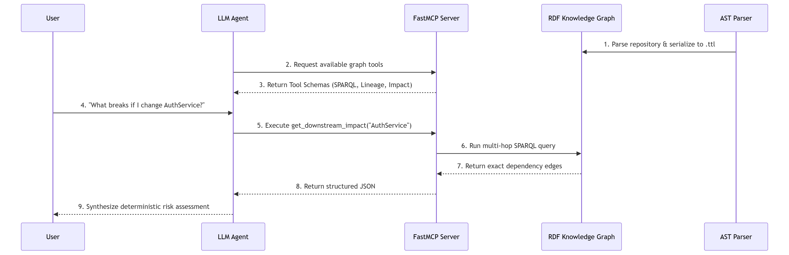

# ACTE: Autonomous Codebase Topography Engine

ACTE parses source code into an RDF knowledge graph and answers structural questions about
it with SPARQL. The goal is that a language model reasoning about a codebase queries proven
relationships instead of inferring them from retrieved text.

Vector search over code returns passages that *look* relevant. A graph query returns the
functions that actually call the one you changed. ACTE is built on the second.



## How it works

| Layer | Does |
|---|---|
| **1. Parse** | tree-sitter walks the AST and extracts files, classes, functions, and the edges between them |
| **2. Build** | those become RDF triples in a `code:` namespace, serialisable to Turtle (`.ttl`) |
| **3. Query** | a fixed set of named SPARQL queries answers callers, callees, dependencies, and dead code |
| **4. Serve** | an MCP server exposing those queries as LLM tools (*not yet implemented*) |

Queries are hardcoded by design. The model chooses which named query to run and supplies
arguments; it never writes SPARQL.

## Status

Early. Layers 1 to 3 exist and are tested; layer 4 has not been started.

| | State |
|---|---|
| AST extraction | Working for Python; Java, JavaScript and TypeScript extract structure only |
| RDF graph + Turtle output | Working |
| Named SPARQL queries | 8 implemented |
| Cross-file call resolution | **Not implemented**, see Limitations |
| Repository ingestion / CLI | Not implemented |
| MCP server | Not implemented |

## Requirements

Python 3.11+ and [Poetry](https://python-poetry.org/).

```bash
poetry install
poetry run pytest -q
```

## Usage

There is no command-line interface yet. The pipeline is used from Python:

```python
from pathlib import Path
from acte.parser import CodeParser
from acte.rdf_builder import KnowledgeGraphBuilder
from acte.sparql_engine import SPARQLEngine

parser  = CodeParser()
builder = KnowledgeGraphBuilder()

for path in Path("src").rglob("*.py"):
    nodes, edges = parser.parse_file(path)
    builder.build(nodes, edges)

builder.serialize("graph.ttl")

engine = SPARQLEngine(graph=builder.graph)
engine.callers_of("db_connect")
engine.functions_in_file("src/app.py")
engine.dependencies_of("src/app.py")
engine.orphan_functions()
```

## Limitations

Stated plainly, because they affect what the results mean.

- **Call targets are recorded as bare names, not qualified identifiers.** A `CALLS` edge
  points at `db_connect` rather than `src/db.py::db_connect`, so it does not connect to the
  function's node. Multi-hop traversal therefore stops after one step, and
  `blast_radius()` currently returns the same results as `callers_of()`. Fixing this is the
  next piece of work.
- **Method calls on variables are not resolved.** `db.connect()` cannot be traced without
  knowing the type of `db`.
- **Dead-code detection over-reports.** Because call targets are unqualified, and because
  entry points and constructors are never called by name, `orphan_functions()` returns
  false positives.
- **Go and TSX are mapped to file extensions but have no grammar rules**, so those files
  produce a file node and nothing else.
- **Class inheritance is not extracted.** The `code:inherits` predicate exists but nothing
  emits it.
- **The graph is held in memory.** Practical ceiling is in the low thousands of files. The
  Turtle output loads into an external triplestore if more is needed.

## Design notes

See [`docs/architecture.md`](docs/architecture.md) for the ontology and the reasoning behind
the main design choices, and [`docs/roadmap.md`](docs/roadmap.md) for planned work.

## Licence

Not yet chosen.
